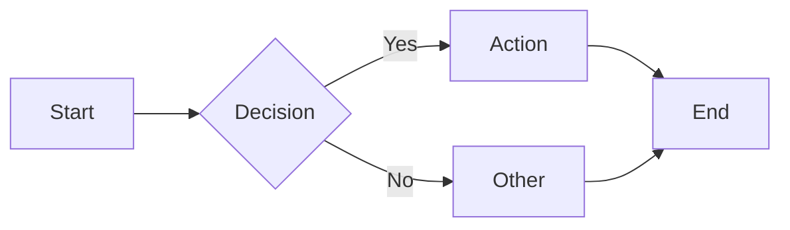
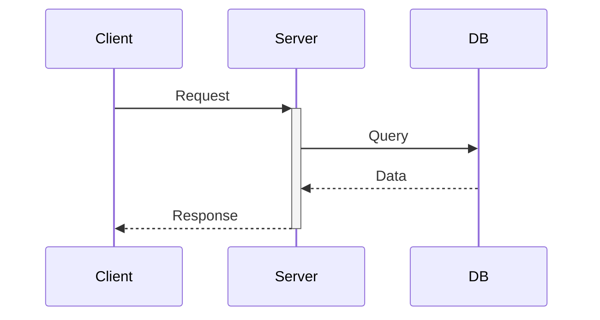
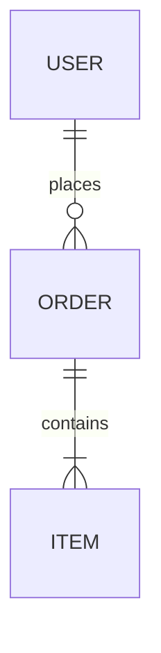
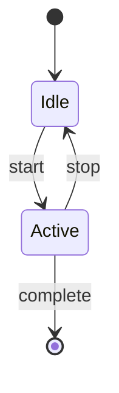
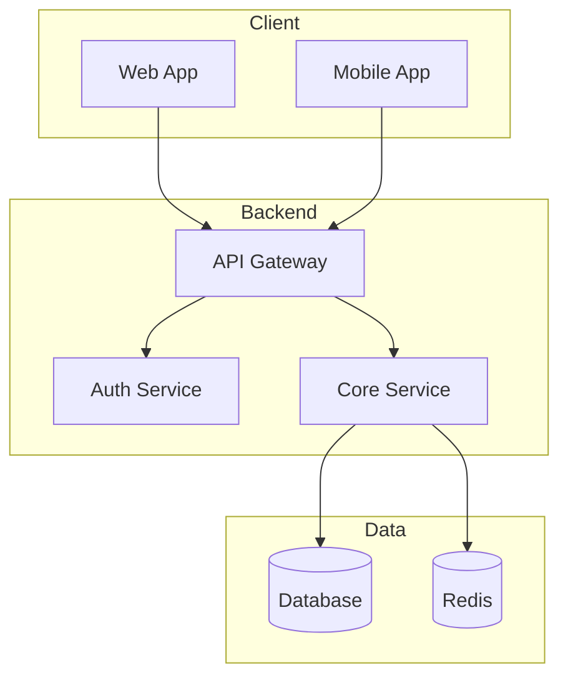
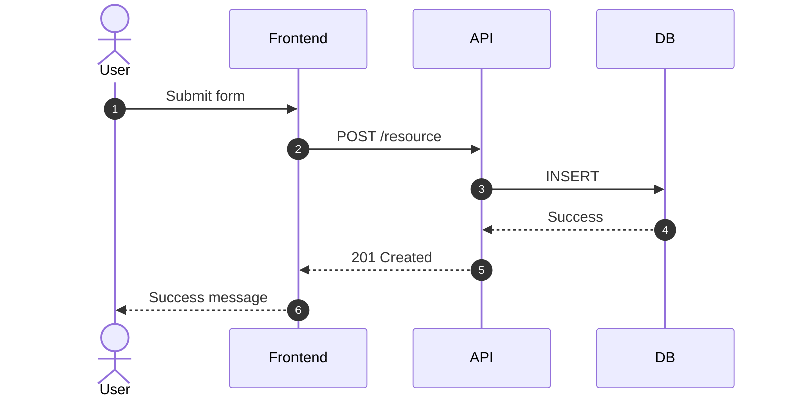
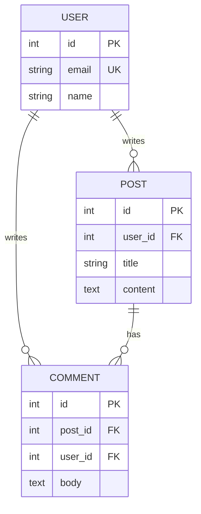
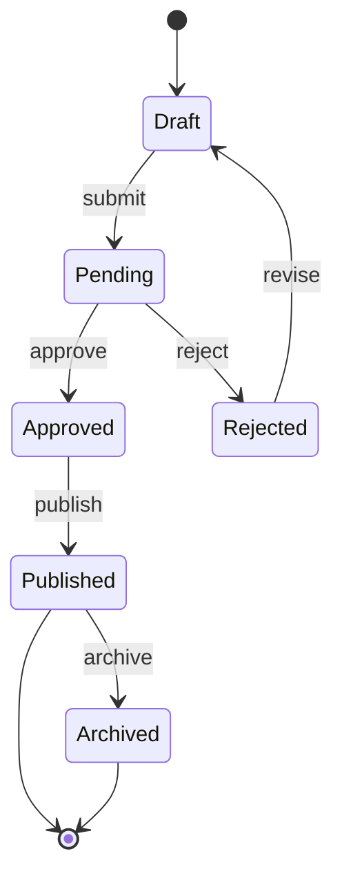

# Mermaid Diagram

Create clear, professional diagrams using Mermaid's text-based syntax.

## Diagram Type Selection

| Request Type | Diagram | Declaration |
|--------------|---------|-------------|
| Process flow, decision tree, algorithm | Flowchart | `flowchart LR` |
| API calls, service interactions, protocols | Sequence | `sequenceDiagram` |
| Database schema, data models | ER Diagram | `erDiagram` |
| Object-oriented design, class structure | Class | `classDiagram` |
| State machines, lifecycle, status flow | State | `stateDiagram-v2` |
| Project timeline, task dependencies | Gantt | `gantt` |
| Brainstorming, concept mapping | Mindmap | `mindmap` |
| Historical events, milestones | Timeline | `timeline` |
| Git branching, version control | Git Graph | `gitGraph` |
| Proportional data, market share | Pie Chart | `pie` |
| Feature prioritization, 2x2 matrix | Quadrant | `quadrantChart` |
| User experience, customer journey | Journey | `journey` |
| System architecture, containers | C4 | `C4Context` |
| Data flow, resource allocation | Sankey | `sankey-beta` |
| Trends, comparisons | XY Chart | `xychart-beta` |
| Task boards, workflow status | Kanban | `kanban` |

## Workflow

1. **Identify diagram type** from user request using table above
2. **Gather entities** - List all nodes, actors, or elements
3. **Define relationships** - Map connections, flows, or dependencies
4. **Choose direction** - `LR` (left-right) for processes, `TB` (top-bottom) for hierarchies
5. **Apply structure** - Use subgraphs/sections for logical grouping
6. **Add styling** - Apply colors sparingly to highlight key elements

## Quick Reference

**Flowchart basics:**


**Sequence basics:**


**ER basics:**


**State basics:**


## Best Practices

**Keep it simple:**
- 5-15 nodes for flowcharts
- Maximum 3-4 nesting levels
- One concept per diagram

**Use clear labels:**
- Short, descriptive node names
- Action verbs on edges ("sends", "creates", "validates")
- Avoid jargon unless domain-specific

**Visual hierarchy:**
- Group related elements in subgraphs
- Use consistent direction (LR for processes, TB for hierarchies)
- Highlight critical paths with styling

**Styling guidelines:**
- Use color sparingly (2-3 colors max)
- Reserve red for errors/warnings
- Reserve green for success/completion
- Use `classDef` for reusable styles

## Reference Documentation

For detailed syntax, see:
- [flowcharts.md](references/flowcharts.md) - Node shapes, arrows, subgraphs, styling
- [sequence-diagrams.md](references/sequence-diagrams.md) - Messages, activations, loops, conditions
- [class-diagrams.md](references/class-diagrams.md) - Classes, relationships, annotations
- [state-diagrams.md](references/state-diagrams.md) - States, transitions, composite states
- [entity-relationship.md](references/entity-relationship.md) - Entities, cardinality, relationships
- [gantt-charts.md](references/gantt-charts.md) - Tasks, dependencies, milestones
- [other-diagrams.md](references/other-diagrams.md) - Pie, mindmap, timeline, git, C4, etc.
- [styling-themes.md](references/styling-themes.md) - Themes, colors, fonts, customization

## Common Patterns

**System architecture:**


**API sequence:**


**Database schema:**


**State machine:**


## Output Format

Always output diagrams in a fenced code block with `mermaid` language identifier:

````

````

This ensures proper rendering in GitHub, GitLab, Obsidian, Notion, and other Markdown renderers.
