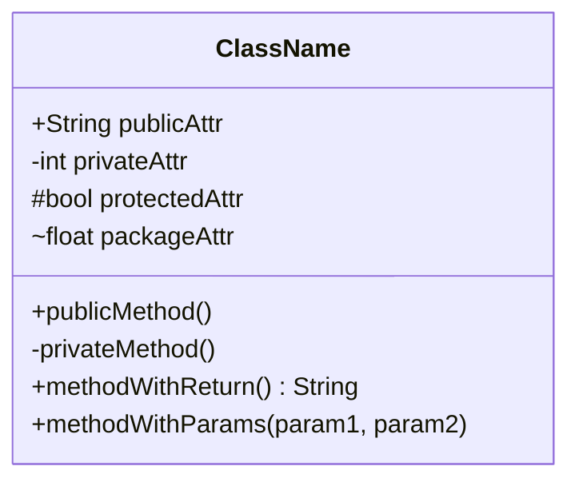
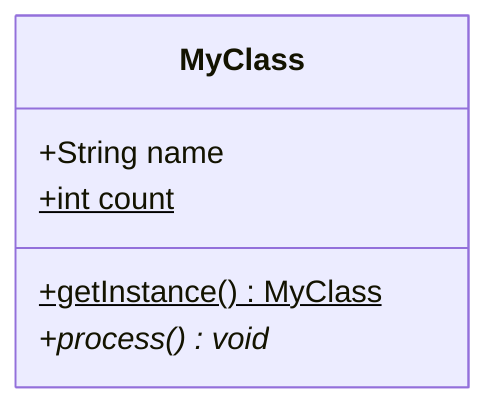
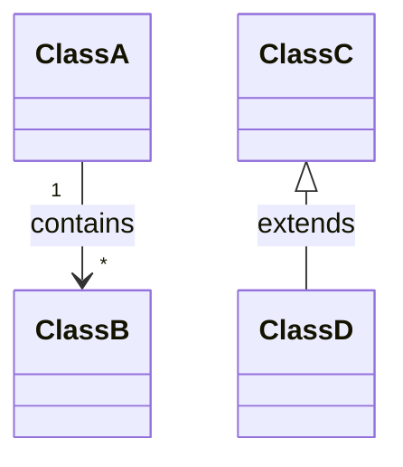
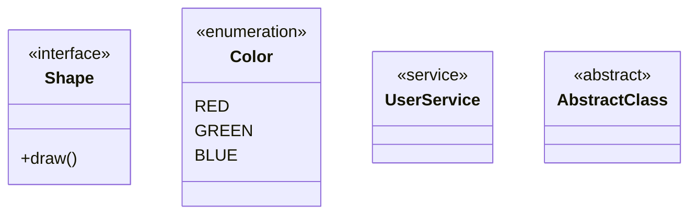
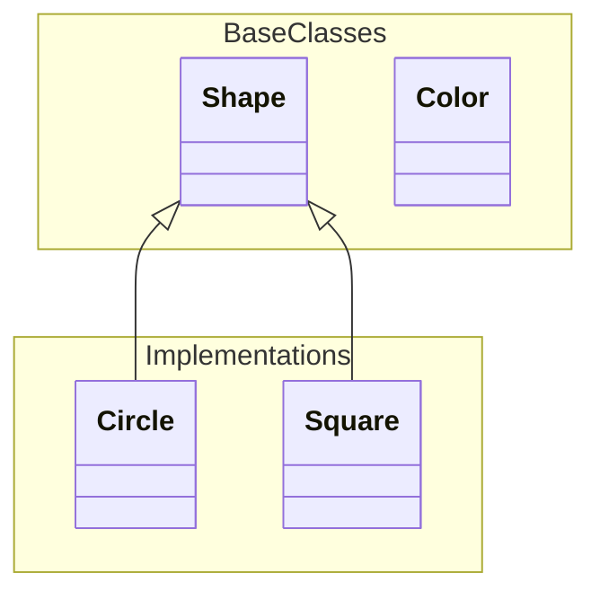
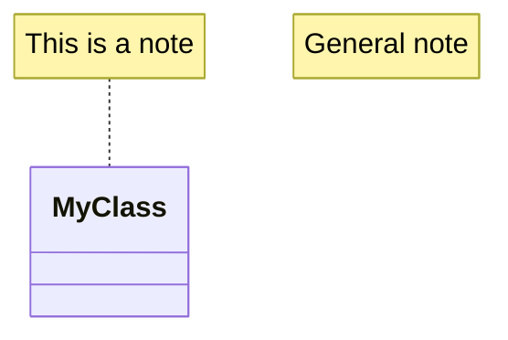
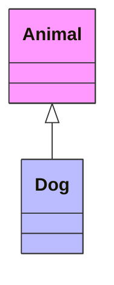
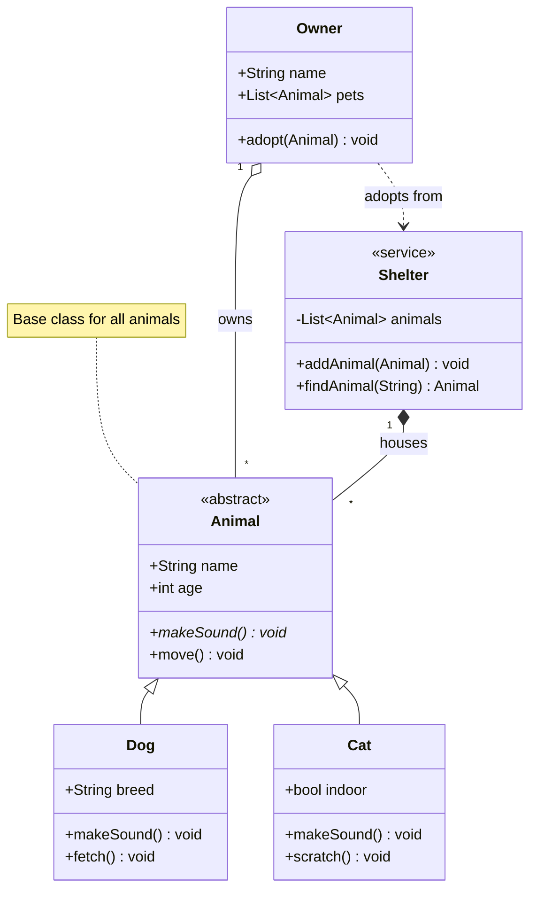

# Class Diagram Reference

## Declaration

```mermaid
classDiagram
```

## Class Definition

**Basic class:**


**Visibility modifiers:**
- `+` Public
- `-` Private
- `#` Protected
- `~` Package/Internal

**Member annotations:**


- `$` Static member
- `*` Abstract method

## Relationships

| Type | Syntax | Description |
|------|--------|-------------|
| Inheritance | `<\|--` | Extends (child to parent) |
| Composition | `*--` | Strong ownership |
| Aggregation | `o--` | Weak ownership |
| Association | `-->` | Uses |
| Dependency | `..>` | Depends on |
| Realization | `..\|>` | Implements |
| Link (solid) | `--` | Related |
| Link (dashed) | `..` | Loosely related |

**With labels:**


**Cardinality:**
- `1` - Exactly one
- `0..1` - Zero or one
- `1..*` - One or more
- `*` - Many
- `n` - n instances
- `0..n` - Zero to n

## Annotations



**Common annotations:**
- `<<interface>>`
- `<<abstract>>`
- `<<enumeration>>`
- `<<service>>`
- `<<entity>>`

## Namespaces



## Notes



## Styling



## Complete Example


