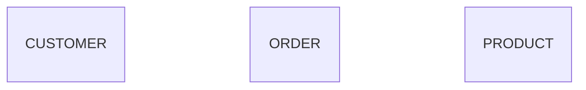
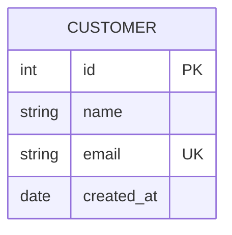
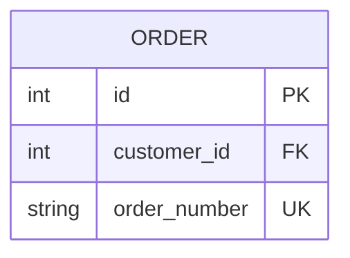
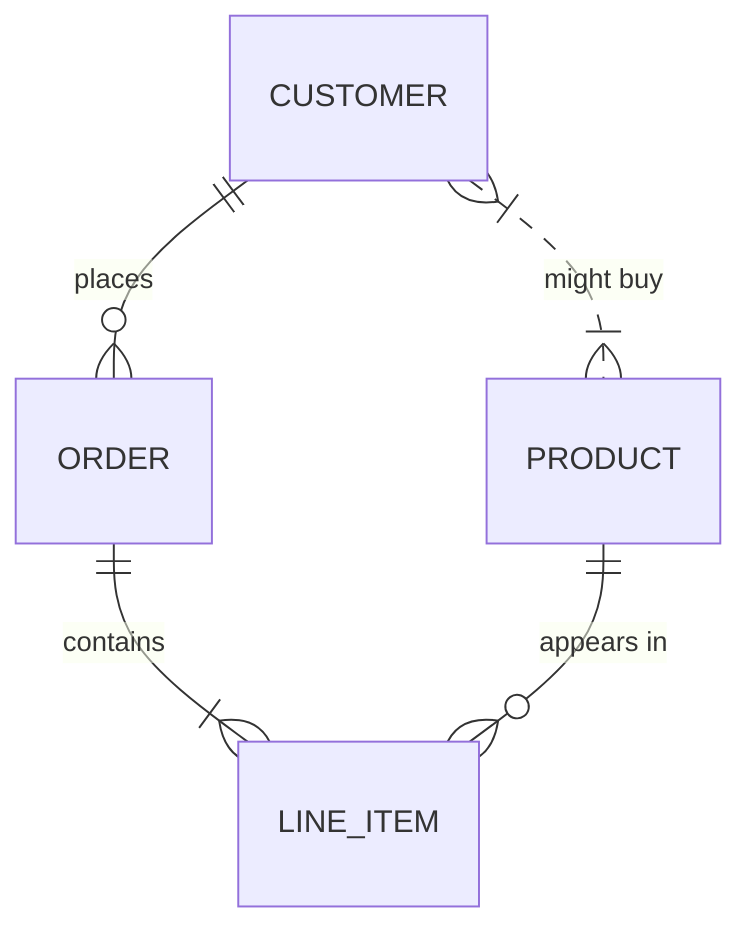
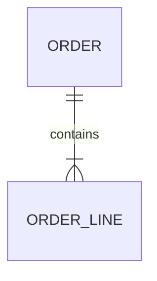
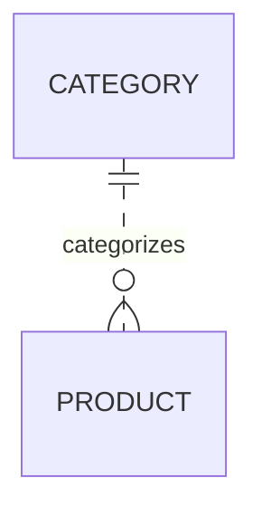
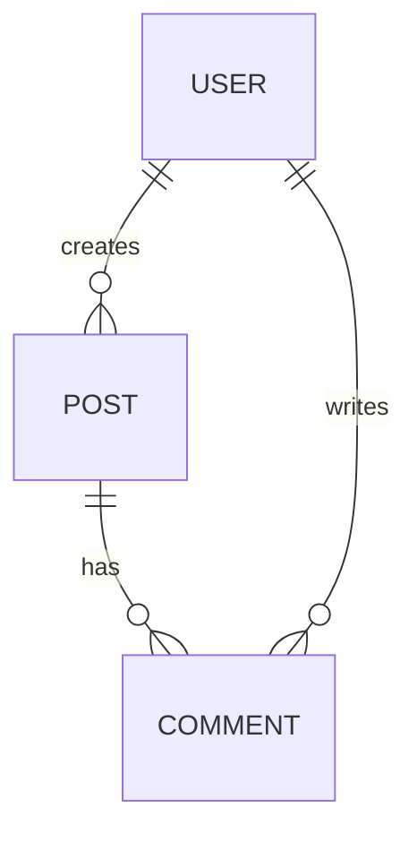
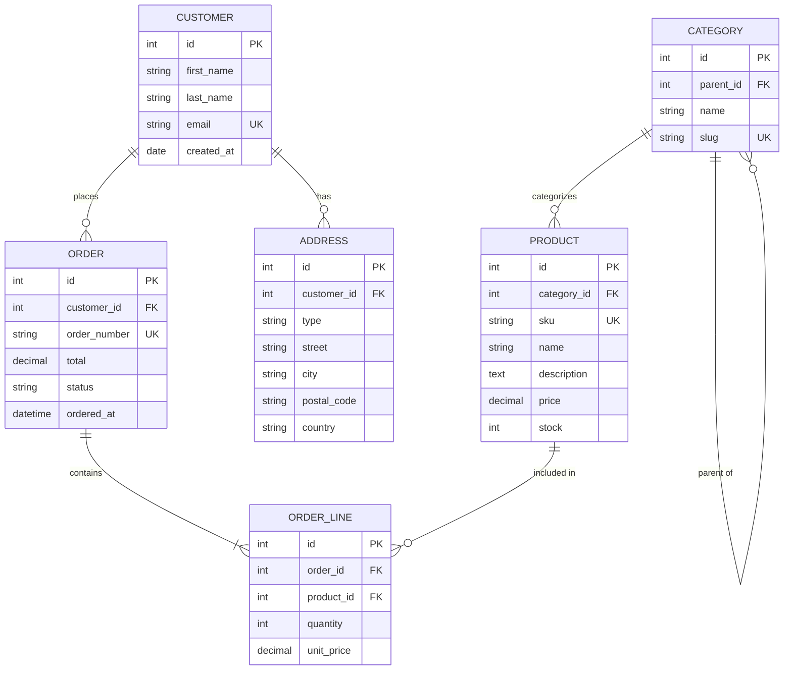

# Entity Relationship Diagram Reference

## Declaration

```mermaid
erDiagram
```

## Entities

**Simple entity:**


**Entity with attributes:**


## Attribute Types

Common types (any string is valid):
- `int`, `integer`, `bigint`
- `string`, `varchar`, `text`
- `bool`, `boolean`
- `date`, `datetime`, `timestamp`
- `float`, `decimal`, `double`
- `uuid`, `json`, `blob`

## Key Constraints

| Constraint | Meaning |
|------------|---------|
| `PK` | Primary Key |
| `FK` | Foreign Key |
| `UK` | Unique Key |



## Relationships

**Cardinality notation:**

| Left | Right | Meaning |
|------|-------|---------|
| `\|o` | `o\|` | Zero or one |
| `\|\|` | `\|\|` | Exactly one |
| `}o` | `o{` | Zero or more |
| `}\|` | `\|{` | One or more |

**Relationship syntax:**
```
EntityA <cardinality>--<cardinality> EntityB : "label"
```

**Common patterns:**


**Relationship types:**
- `--` Solid line (identifying relationship)
- `..` Dashed line (non-identifying relationship)

## Identifying vs Non-Identifying

**Identifying (solid line):** Child cannot exist without parent


**Non-Identifying (dashed line):** Child can exist independently


## Relationship Labels

Labels should describe the relationship verb:
- `places`, `contains`, `belongs to`
- `has`, `owns`, `manages`
- `creates`, `updates`, `references`



## Aliases

```mermaid
erDiagram
    c[CUSTOMER] ||--o{ o[ORDER] : places
```

## Complete Example


