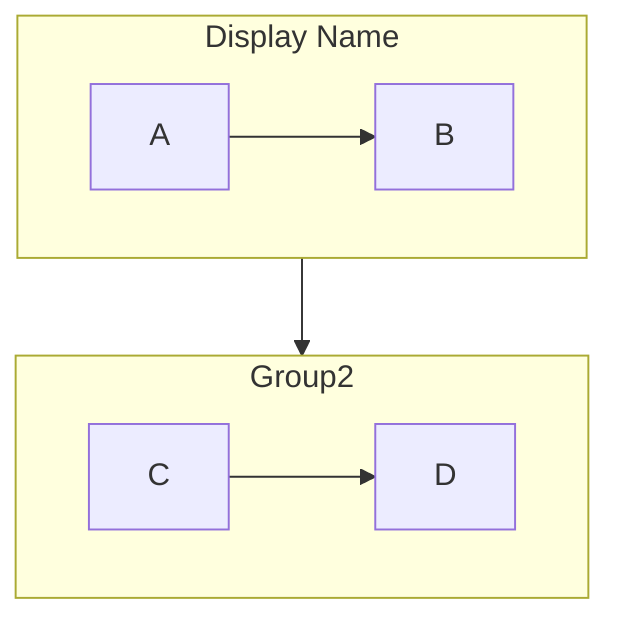
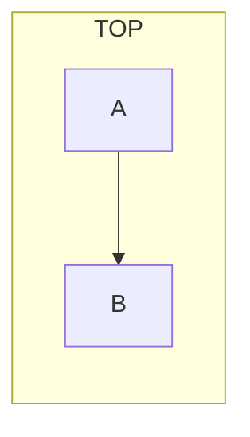
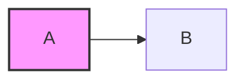
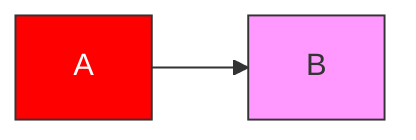
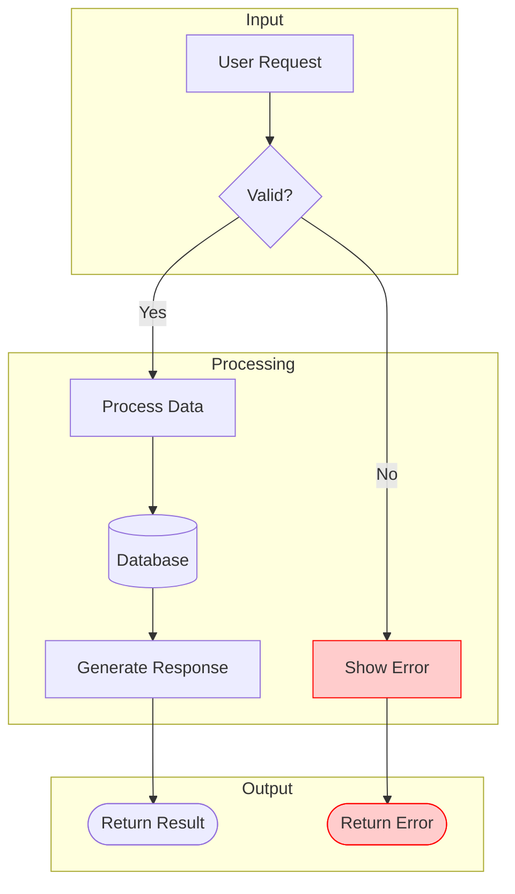

# Flowchart Reference

## Declaration

```mermaid
flowchart <direction>
```

**Directions:**
- `TB` / `TD` - Top to Bottom/Down
- `BT` - Bottom to Top
- `LR` - Left to Right
- `RL` - Right to Left

## Node Shapes

| Shape | Syntax | Use Case |
|-------|--------|----------|
| Rectangle | `[text]` | Process/action |
| Rounded | `(text)` | Start/end |
| Stadium | `([text])` | Terminal |
| Subroutine | `[[text]]` | Subroutine/module |
| Cylinder | `[(text)]` | Database |
| Circle | `((text))` | Connector |
| Asymmetric | `>text]` | Input/output |
| Rhombus | `{text}` | Decision |
| Hexagon | `{{text}}` | Preparation |
| Parallelogram | `[/text/]` | Input |
| Parallelogram Alt | `[\text\]` | Output |
| Trapezoid | `[/text\]` | Manual operation |
| Trapezoid Alt | `[\text/]` | Manual operation |
| Double Circle | `(((text)))` | Double circle |

## Link Types

| Type | Syntax | Description |
|------|--------|-------------|
| Arrow | `-->` | Solid arrow |
| Open | `---` | Solid line |
| Dotted | `-.-` | Dotted line |
| Dotted Arrow | `-.->` | Dotted arrow |
| Thick | `===` | Thick line |
| Thick Arrow | `==>` | Thick arrow |
| Invisible | `~~~` | No line (spacing) |

**With text:**
- `-- text -->` or `-->|text|`
- `-. text .->` or `-.->|text|`
- `== text ==>` or `==>|text|`

## Subgraphs



**Subgraph direction:**


## Styling

**Inline style:**


**Class definitions:**


**Common style properties:**
- `fill` - Background color
- `stroke` - Border color
- `stroke-width` - Border width
- `color` - Text color
- `stroke-dasharray` - Dashed border (e.g., `5 5`)

## Complete Example


