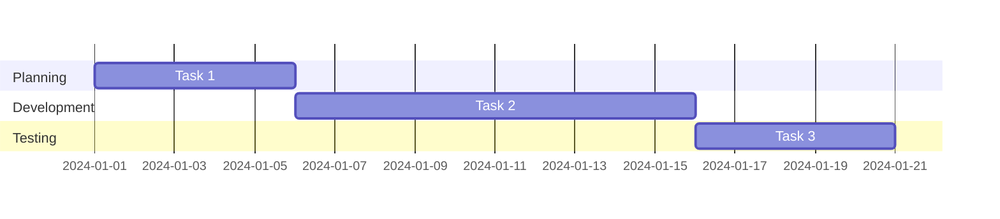
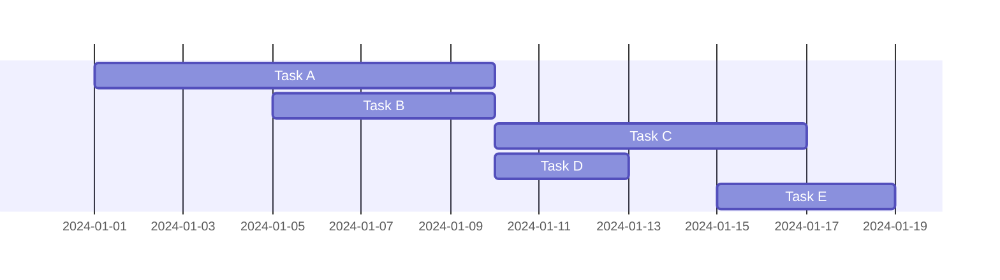
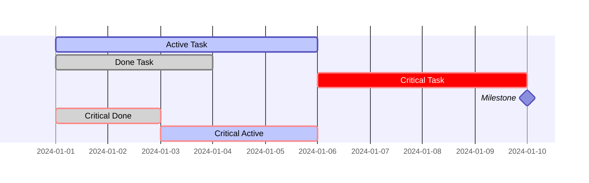
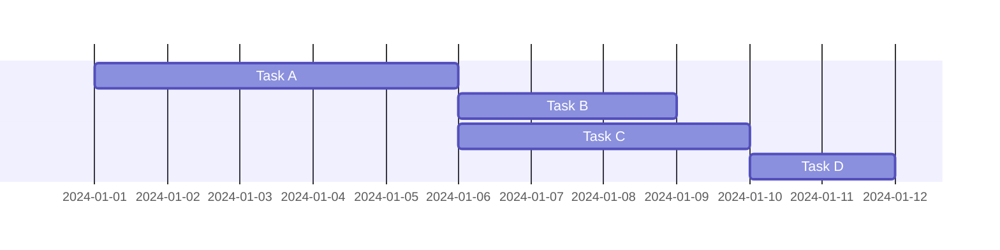
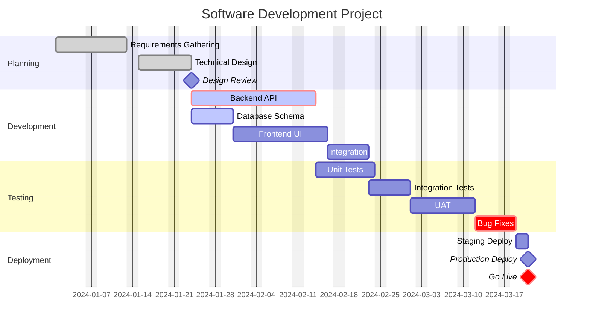

# Gantt Chart Reference

## Declaration

```mermaid
gantt
```

## Configuration

```mermaid
gantt
    title Project Timeline
    dateFormat YYYY-MM-DD
    excludes weekends
    tickInterval 1week
```

**Date formats:**
- `YYYY-MM-DD` (default)
- `DD-MM-YYYY`
- `MM-DD-YYYY`
- `YYYY-MM-DD HH:mm`

**Axis format (display):**
```mermaid
gantt
    axisFormat %Y-%m-%d
    axisFormat %b %d    %%Jan 15
    axisFormat %m/%d    %%01/15
```

## Sections



## Task Syntax

**Full syntax:**
```
TaskName : [status], [id], [start], [duration or end]
```

**Examples:**


## Task States



## Dependencies



## Duration Units

- `5d` - 5 days
- `1w` - 1 week
- `2h` - 2 hours (with time format)
- `30m` - 30 minutes (with time format)

## Excluding Dates

```mermaid
gantt
    dateFormat YYYY-MM-DD
    excludes weekends
    excludes 2024-01-15, 2024-01-16
```

## Tick Intervals

```mermaid
gantt
    tickInterval 1day
    tickInterval 1week
    tickInterval 1month
```

## Complete Example


