# Other Diagram Types Reference

## Pie Chart

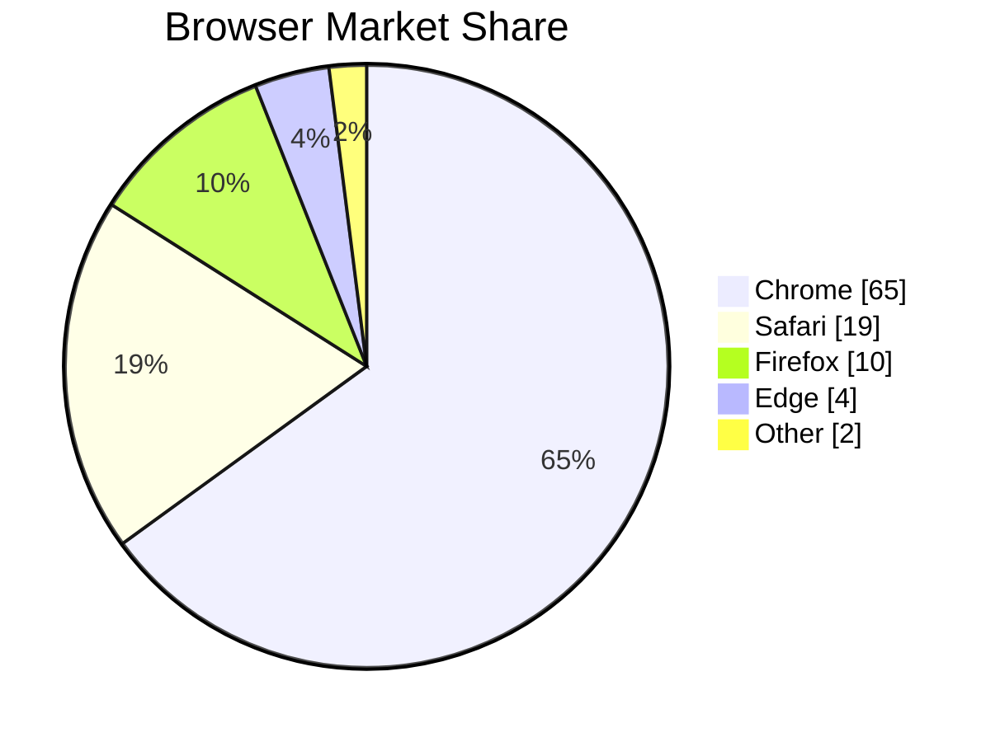

- `showData` - Optional, shows values on chart
- Values can be percentages or raw numbers (auto-calculated)

## User Journey

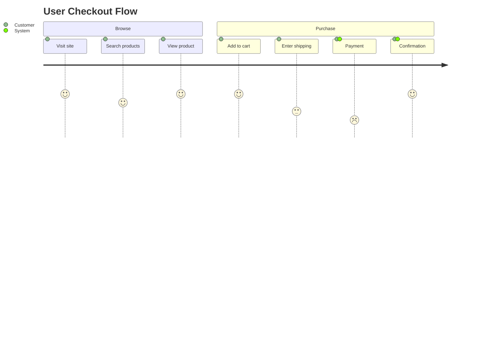

- Score: 1-5 (satisfaction level)
- Actors listed after score

## Mindmap

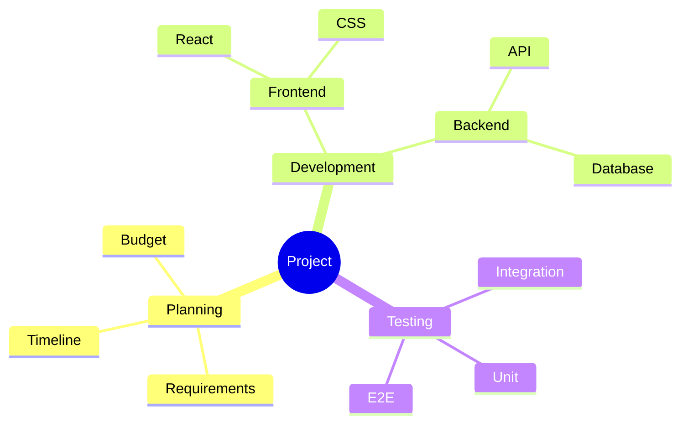

**Node shapes:**
- `root` - Default
- `root((text))` - Circle
- `root)text(` - Bang
- `root[text]` - Square
- `root(text)` - Rounded

## Timeline

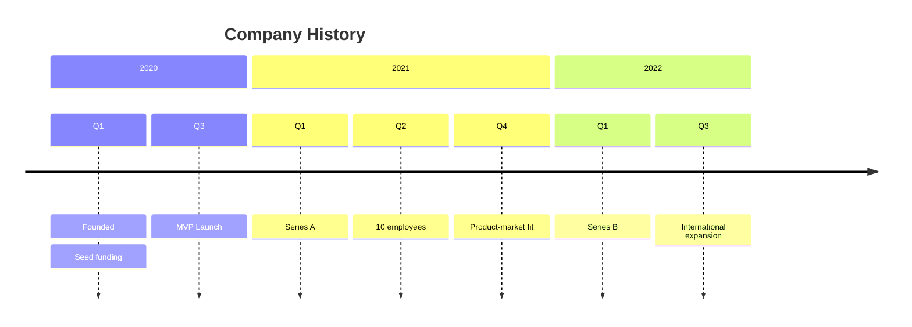

## Git Graph

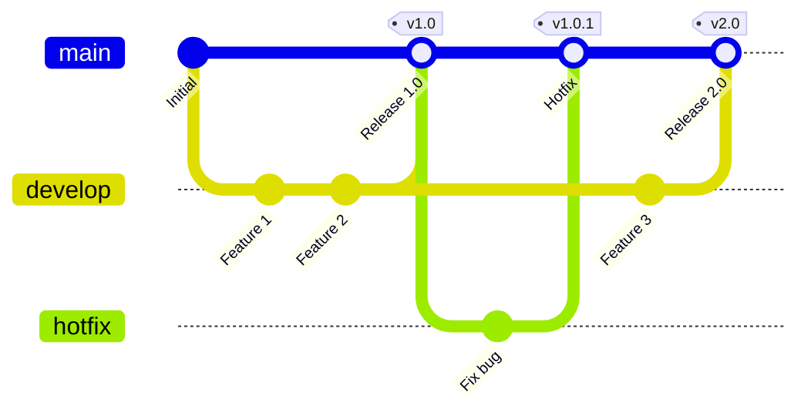

**Commands:**
- `commit` - Add commit
- `branch <name>` - Create branch
- `checkout <name>` - Switch branch
- `merge <name>` - Merge branch
- `cherry-pick id: "x"` - Cherry pick

**Options:**
- `id: "text"` - Commit message
- `tag: "v1.0"` - Add tag
- `type: HIGHLIGHT` - Highlight commit

## Quadrant Chart

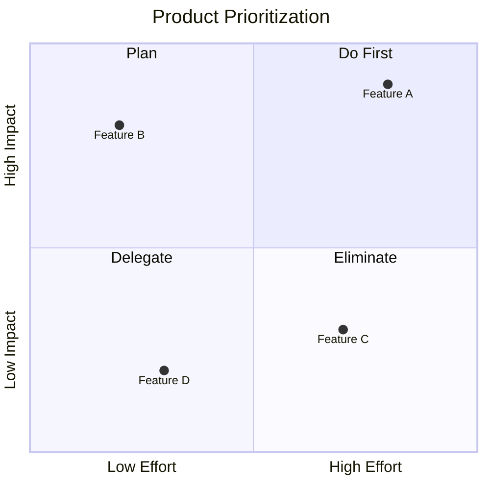

## XY Chart

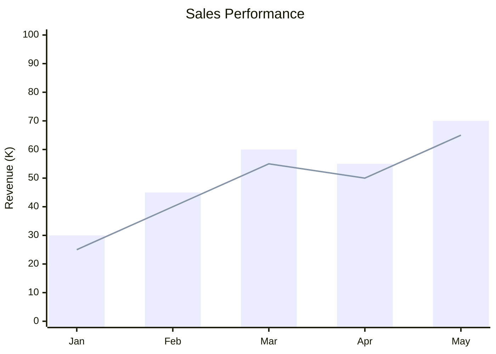

## Sankey Diagram

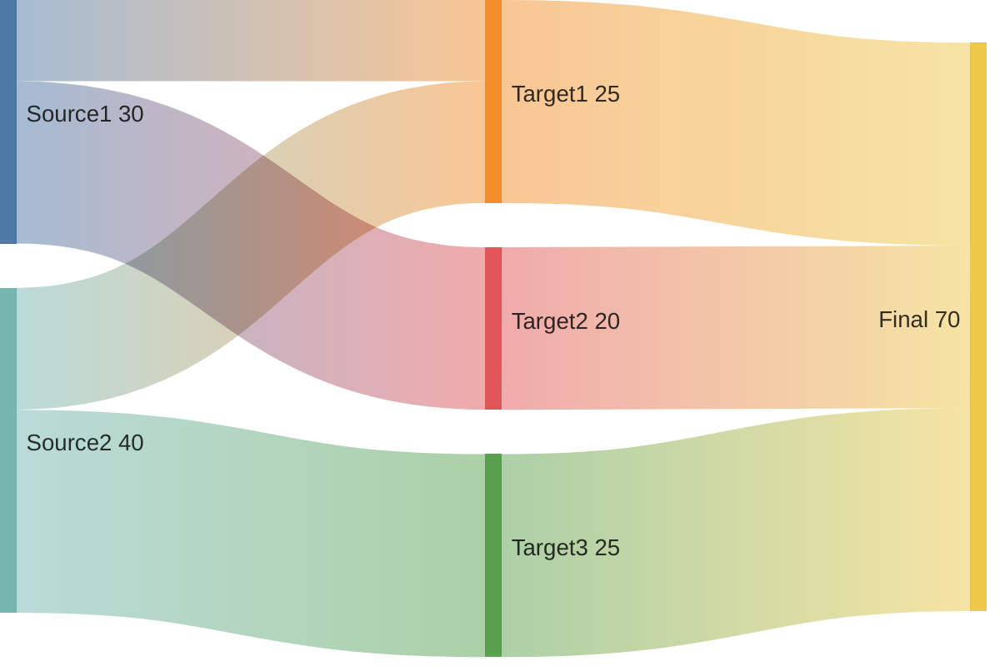

## Block Diagram

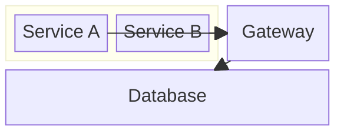

## C4 Diagram

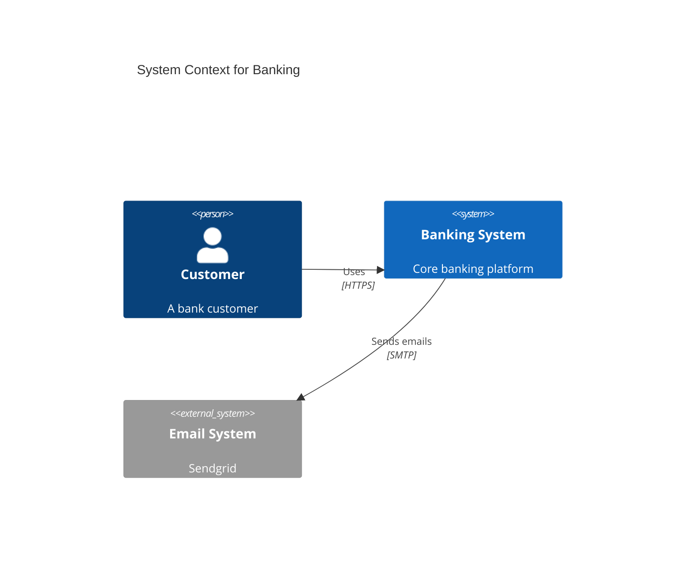

**Diagram types:**
- `C4Context` - Context diagram
- `C4Container` - Container diagram
- `C4Component` - Component diagram
- `C4Dynamic` - Dynamic diagram

## Architecture Diagram

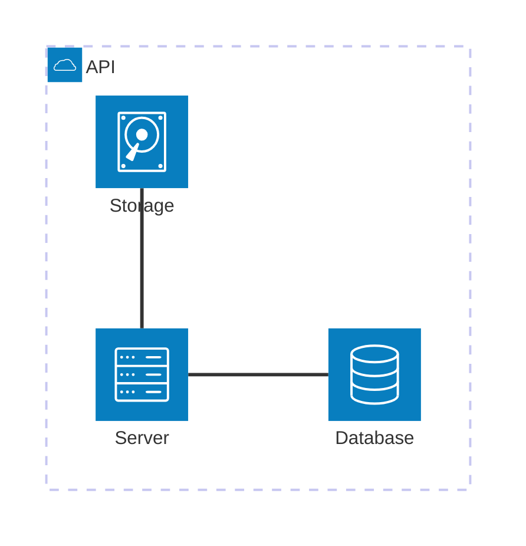

## Kanban

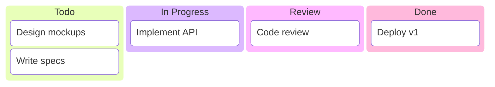
