# Sequence Diagram Reference

## Declaration

```mermaid
sequenceDiagram
```

## Participants

**Define participants (optional but controls order):**
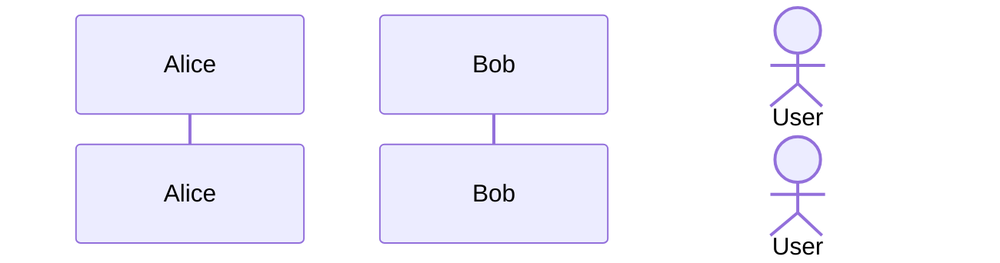

- `participant` - Box shape
- `actor` - Stick figure shape

## Message Types

| Type | Syntax | Description |
|------|--------|-------------|
| Solid line | `->` | Synchronous |
| Dotted line | `-->` | Return |
| Solid arrow | `->>` | Async message |
| Dotted arrow | `-->>` | Async return |
| Cross | `-x` | Lost message |
| Dotted cross | `--x` | Lost async |
| Open arrow | `-)` | Async (open) |
| Dotted open | `--)` | Async return (open) |

## Activations

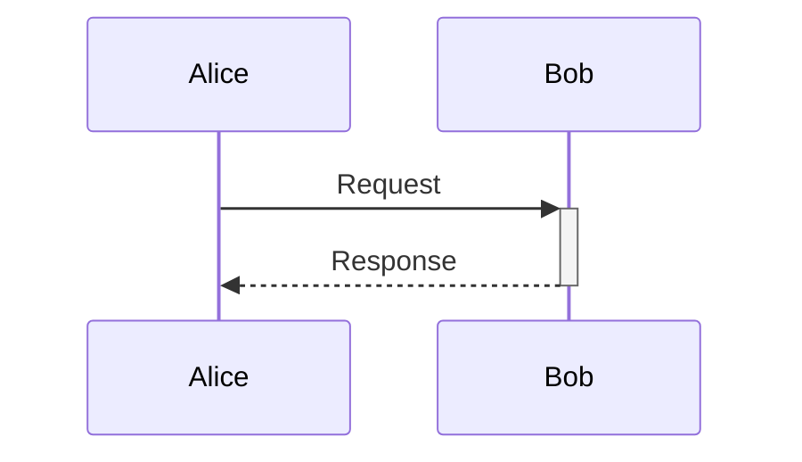

Or explicit:
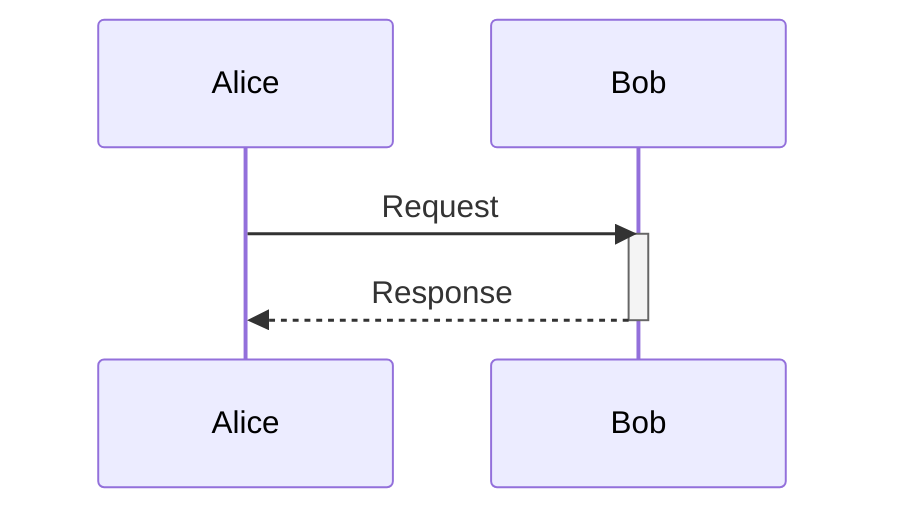

**Nested activations:**
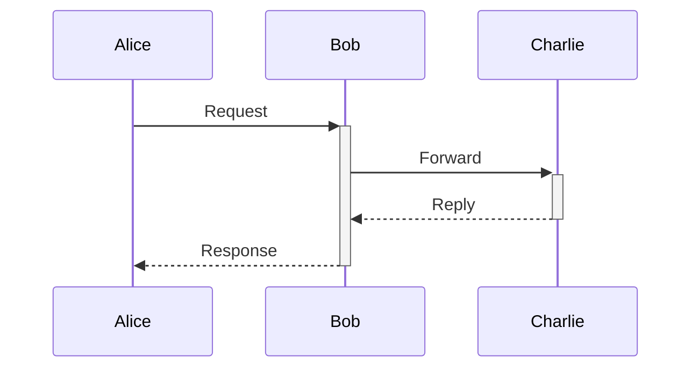

## Notes

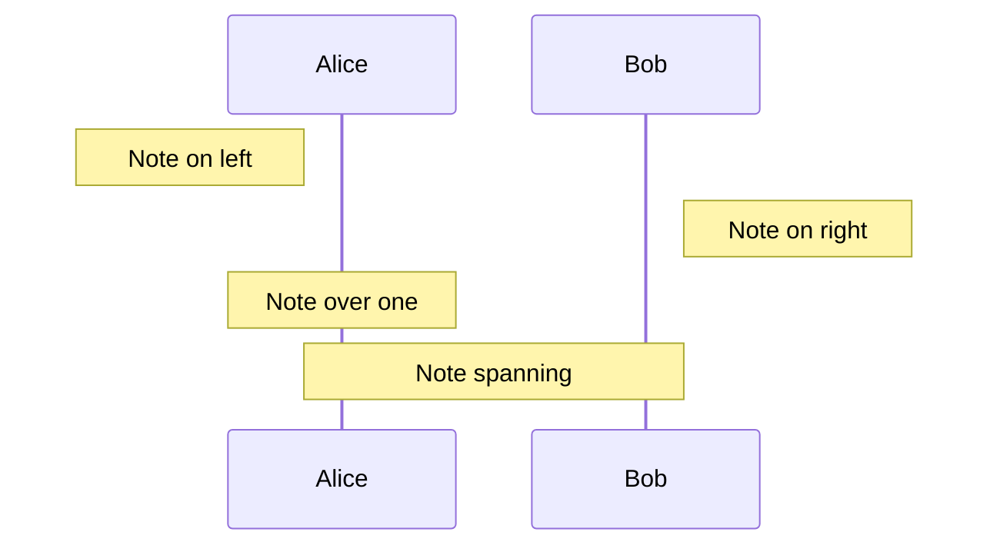

## Loops and Conditions

**Loop:**
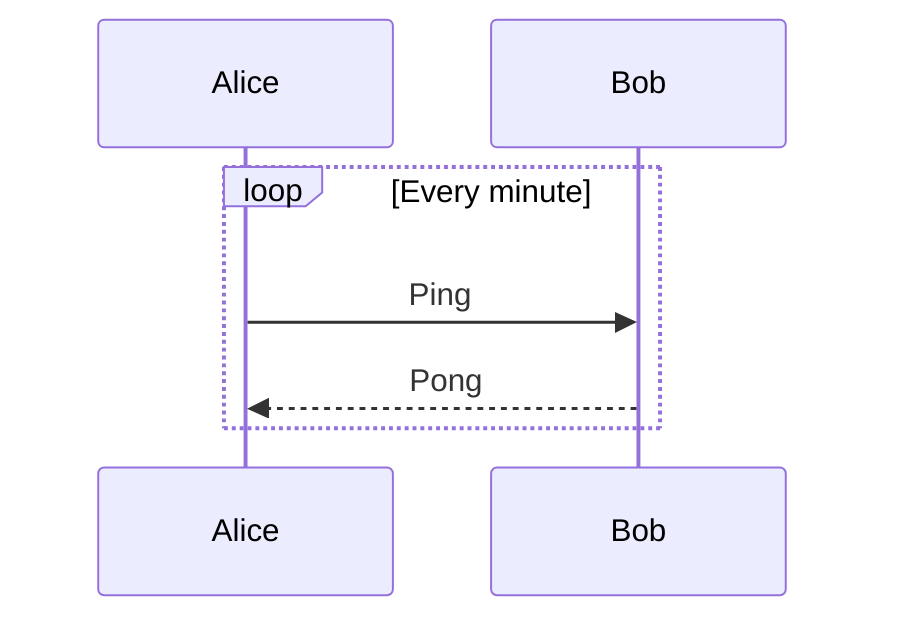

**Alt (if/else):**
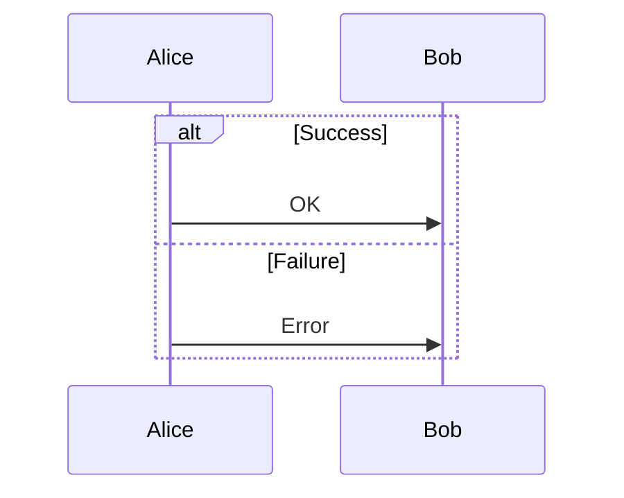

**Opt (optional):**
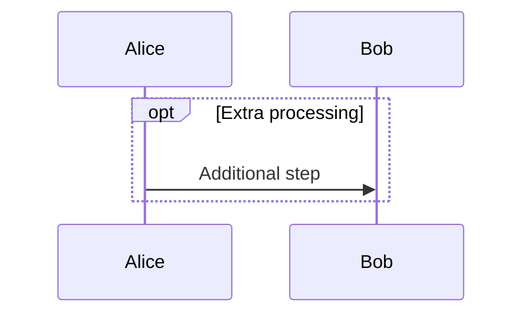

**Par (parallel):**
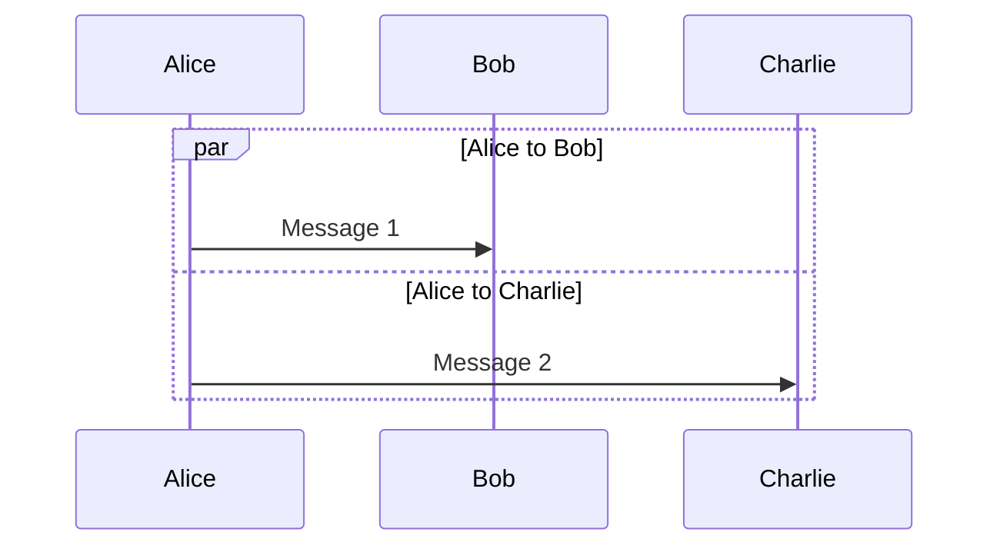

**Critical (must complete):**
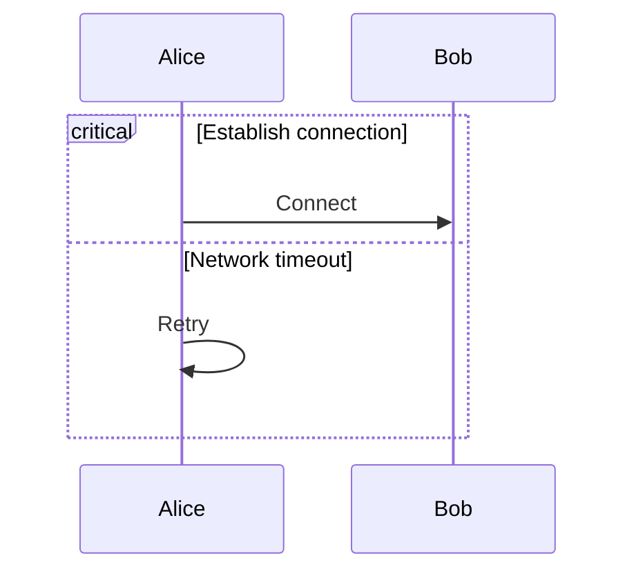

**Break (exit early):**
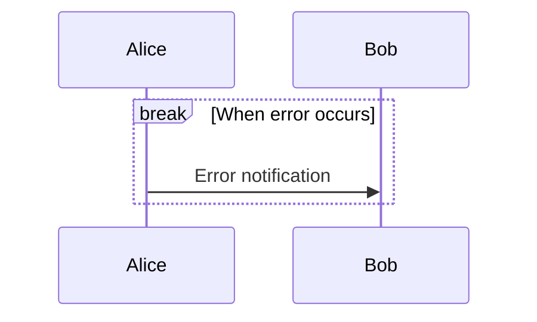

## Background Highlighting

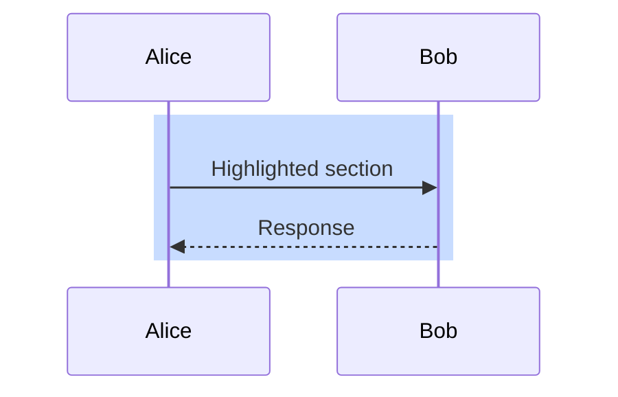

## Sequence Numbers

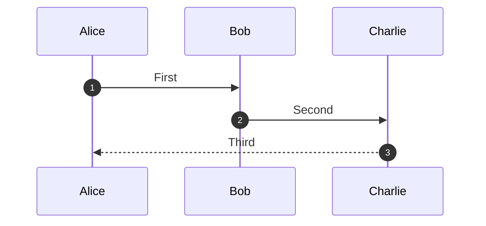

## Complete Example

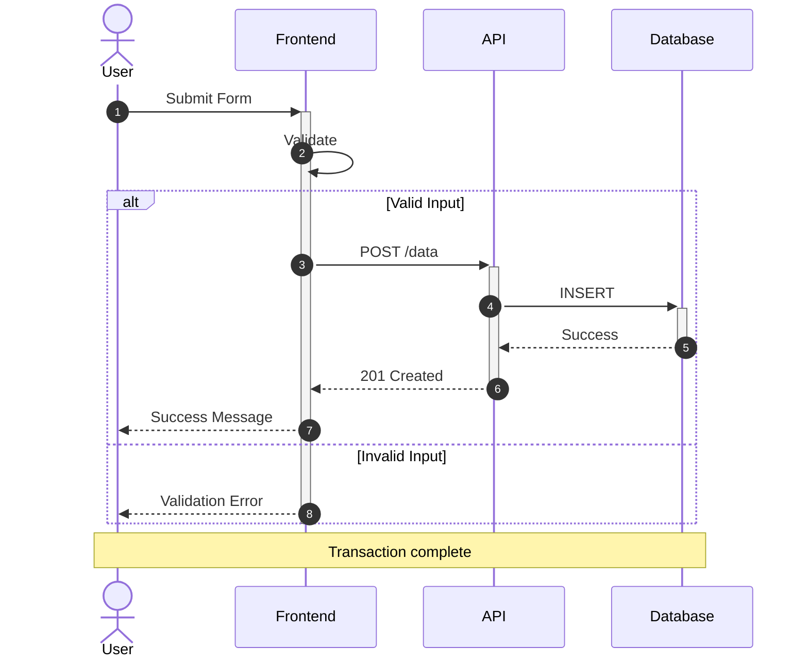
