# State Diagram Reference

## Declaration

```mermaid
stateDiagram-v2
```

Note: Use `stateDiagram-v2` for the newer, more feature-rich version.

## States

**Simple states:**
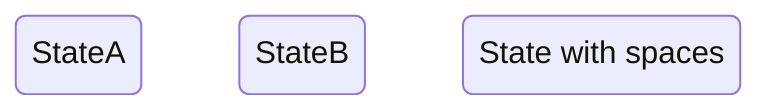

**Start and end:**
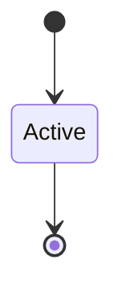

- `[*]` represents both start (when source) and end (when target)

## Transitions

**Basic:**
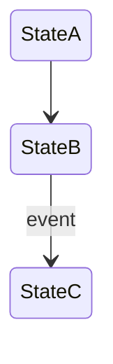

**With labels:**
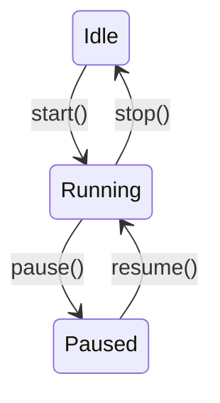

## Composite States

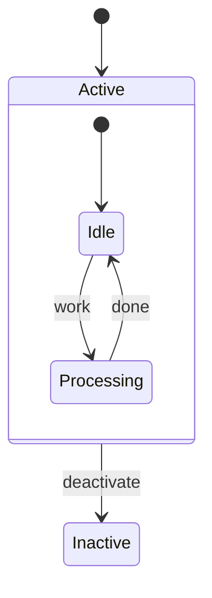

**Nested composite states:**
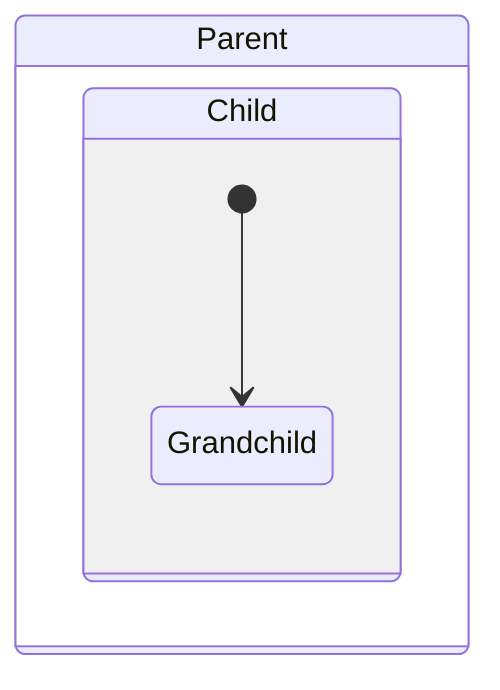

## Choice (Conditional)

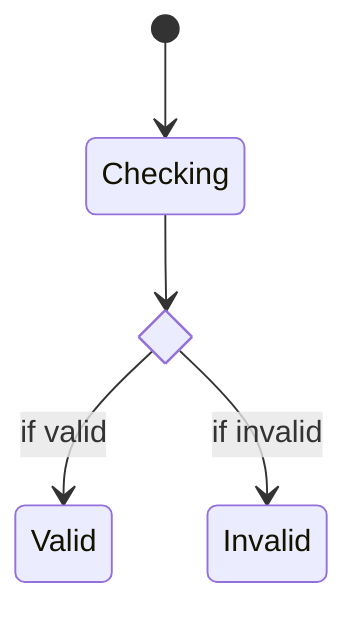

## Fork and Join (Parallel)

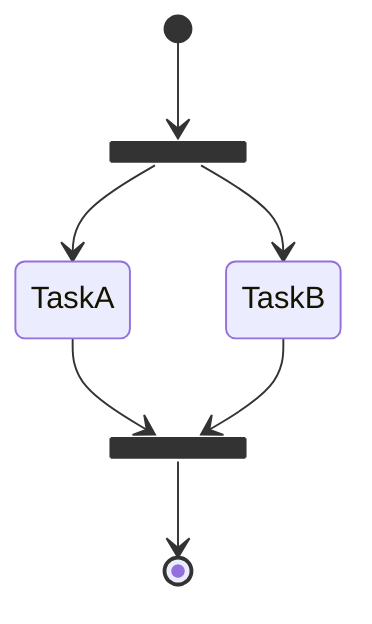

## Notes

```mermaid
stateDiagram-v2
    State1 : Description line 1
    State1 : Description line 2

    note right of State1
        Extended note
        with multiple lines
    end note

    note left of State2 : Short note
```

## Concurrency

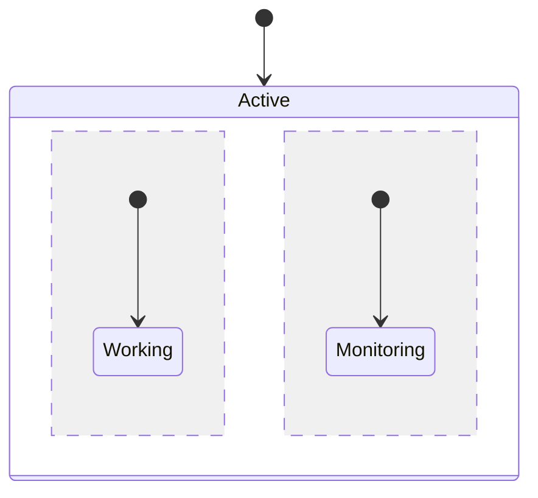

The `--` separator creates concurrent regions.

## Direction

```mermaid
stateDiagram-v2
    direction LR
    [*] --> A --> B --> [*]
```

Directions: `LR`, `RL`, `TB`, `BT`

## Styling

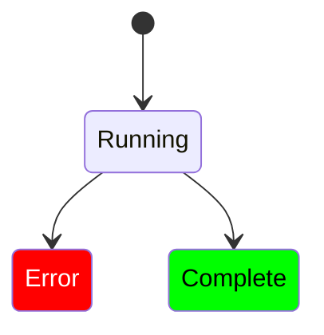

## Complete Example

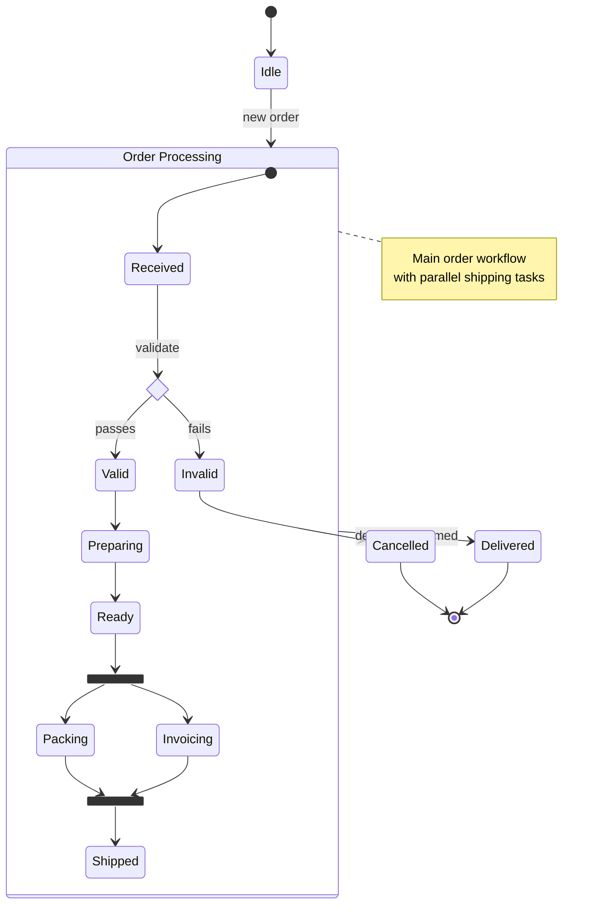
