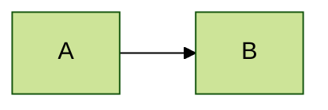
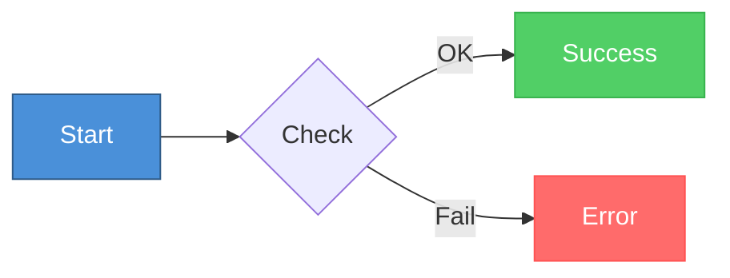
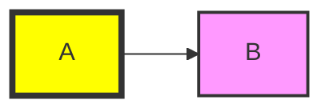
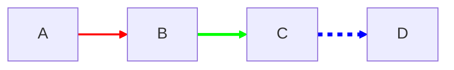
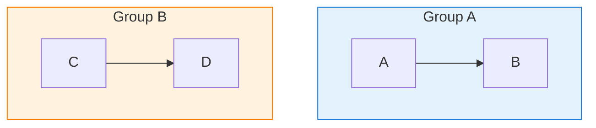
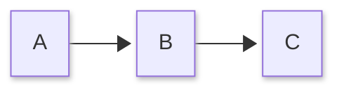
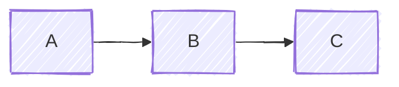
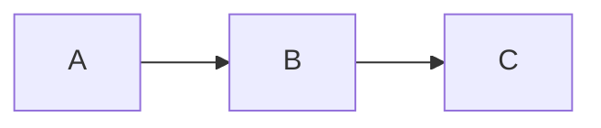
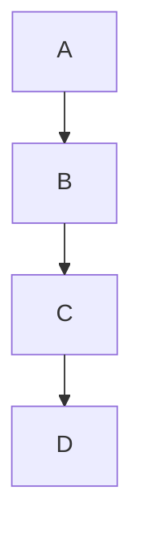
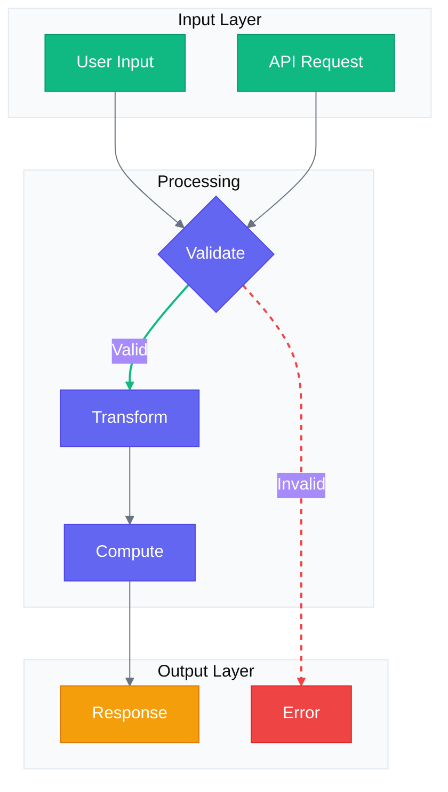

# Styling and Themes Reference

## Themes

**Available themes:**
- `default` - Standard theme
- `neutral` - Black and white, print-friendly
- `dark` - Dark mode
- `forest` - Green tones
- `base` - Customizable base theme

**Apply theme via frontmatter:**


**Apply theme via directive:**


## Theme Variables

Only `base` theme supports customization:


**Common theme variables:**
| Variable | Description |
|----------|-------------|
| `primaryColor` | Main node background |
| `primaryTextColor` | Main node text |
| `primaryBorderColor` | Main node border |
| `secondaryColor` | Secondary elements |
| `tertiaryColor` | Tertiary elements |
| `lineColor` | Connector lines |
| `textColor` | General text |
| `mainBkg` | Background color |
| `nodeBorder` | Node border color |
| `clusterBkg` | Subgraph background |
| `clusterBorder` | Subgraph border |

## Class Definitions (classDef)

**Define and apply:**


**Apply to multiple nodes:**


**Default class:**


## Style Properties

| Property | Example | Description |
|----------|---------|-------------|
| `fill` | `#ff0000` | Background color |
| `stroke` | `#333` | Border color |
| `stroke-width` | `2px` | Border width |
| `color` | `#fff` | Text color |
| `stroke-dasharray` | `5 5` | Dashed border |
| `opacity` | `0.5` | Transparency |
| `rx` | `10` | Border radius (x) |
| `ry` | `10` | Border radius (y) |

## Inline Styles



## Link Styles



**Style all links:**
```mermaid
flowchart LR
    linkStyle default stroke:#999,stroke-width:2px
```

## Subgraph Styling



## Look Customization

**Neo (modern) look:**


**Hand-drawn look:**


**Classic look:**


## Layout Algorithm

**ELK (better for complex diagrams):**


## Font Customization


## Complete Styled Example


